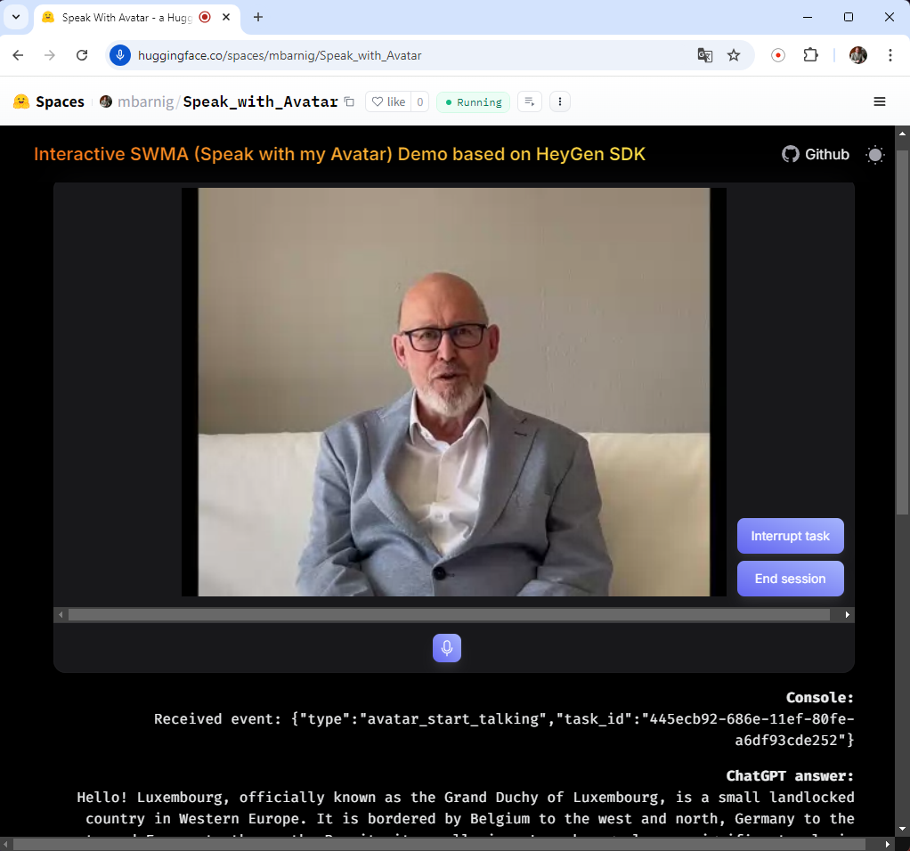

# Speak with my Avatar

The primary purpose of this customized version is to optimize the speech recognition model to ensure accurate transcription in English, French, and German, while providing quick vocal delivery in the respective language.
